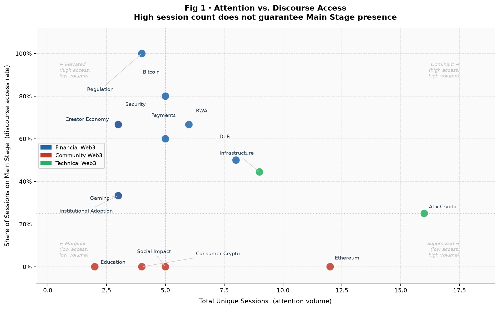
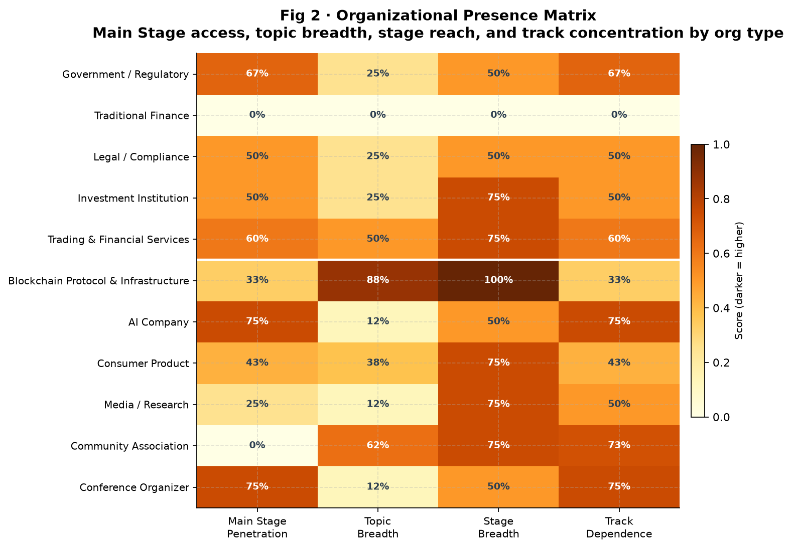
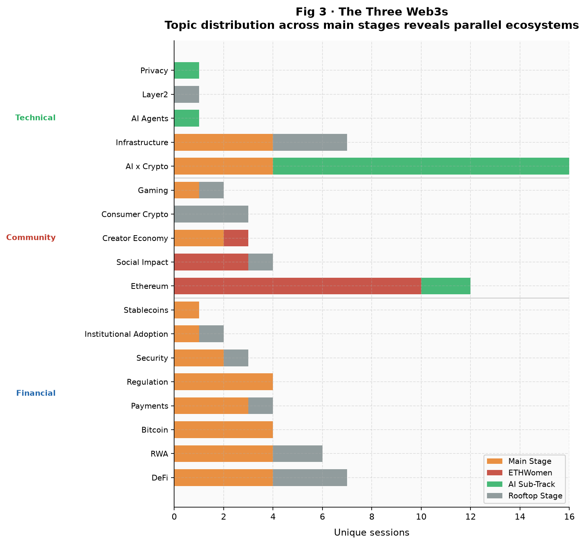
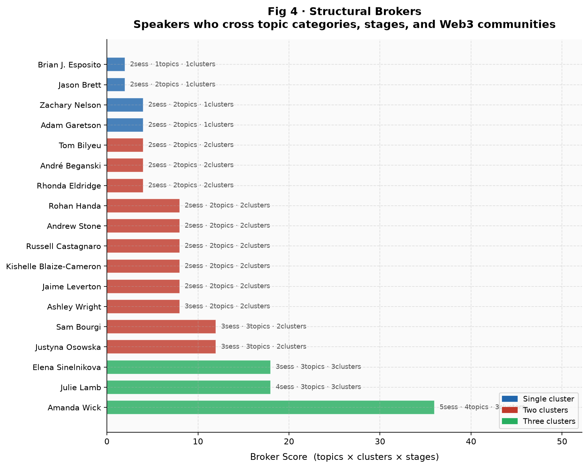
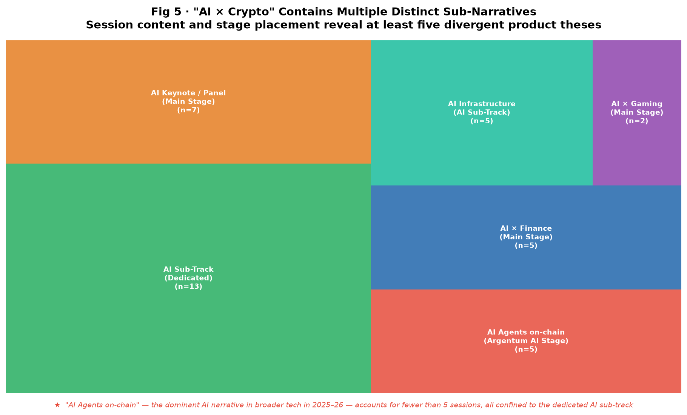

# 注意力不等于话语权
## 2025 Blockchain Futurist Conference 议程的叙事准入结构分析

*2025 Blockchain Futurist Conference · 议程数据分析报告*

---

**摘要**

本文以 2025 Blockchain Futurist Conference 的完整议程数据为基础，构建「议题—舞台—演讲者—组织」四层分析框架，系统考察注意力分配（session 出现频率）与叙事准入机会（主舞台占比）之间的结构性关系。核心发现包括：话题热度与主舞台准入率之间存在系统性解耦；不同类型参与组织的议题覆盖广度与话语中心准入率之间呈反向关联；三类相对独立的 Web3 议题社群共存于同一会议空间，彼此之间几乎不产生话题交叉；"AI × Crypto" 标签内部高度分化，主舞台与专属子赛道分别承载不同的受众逻辑与产品假设。研究表明，主舞台准入受到议题框架、机构身份与赞助资本等多重因素的共同塑造，而非单纯由话题热度决定。

---

> 一场 Web3 会议的议程，不仅是话题的排行榜，更是一张叙事准入的结构图。注意力（session 数量）和话语准入机会（主舞台占比）在这里系统性地解耦——出现最多的议题，未必能进主舞台；社区声量最大的组织，未必占据叙事中心；而跨越话题边界、舞台层级与社群分野的连接能力，则集中于极少数演讲者身上。

---

## 一、议程作为叙事结构的可读文本

一场会议的议程，不只是场次安排的技术结果，也是内容优先级的表态——哪些话题值得最多曝光，哪类声音应该出现在最重要的位置，哪些组织获得了定义叙事的机会。这些选择，构成了一种可以被测量的结构。

当议程设计决定哪个议题进主舞台、哪类组织可以发言、哪些演讲者能在同一天出现在三个不同赛道，它实际上在做一件更根本的事：分配叙事准入的机会。

热度（attention）是可以被量化的，通过统计每个话题出现了多少场 session 即可呈现。叙事准入（discursive access）则更难被看见——它藏在舞台层级里，藏在组织背景里，藏在演讲者能够跨越哪些社群边界的能力里。

本文分析 2025 Blockchain Futurist Conference 的完整议程数据，涵盖去重后 **140 个唯一 session、215 位演讲者、199 家参与组织**。在数据清洗与原始截图交叉核验的基础上，从以下四个层次建立分析模型：

| 层次 | 分析维度 |
|------|----------|
| **议题层** | 内容是什么，属于哪个话题类别 |
| **舞台层** | 注意力被分配在哪个层级的舞台 |
| **演讲者层** | 谁获得了表达机会，跨越了哪些边界 |
| **组织层** | 谁在这个声音背后，代表什么类型的利益与身份 |

---

## 二、注意力与话语准入的系统性解耦

第一个问题：哪些话题在全场出现最多，哪些话题真正进入了主舞台？

将每个议题的全场 session 总数（注意力热度）对比其在 Main Stage 的占比（话语准入率），可以构建出一张张力地图（图 1）。

*图 1 · 注意力热度 vs. 主舞台准入率。X 轴为全场唯一 session 数（注意力体量），Y 轴为进入 Main Stage 的 session 比例（话语准入率）。颜色区分金融类、社区类、技术类三个议题簇。右上角为高热度高准入的"主导"区域，右下角为高热度低准入的"受限"区域。*

图表揭示了两个结构性差异鲜明的区域：

**高准入区域（图右上）：机构叙事的优先位置。** RWA（真实世界资产代币化）、Regulation（监管）和 Bitcoin 是主舞台准入率最高的话题，尽管它们的全场总场次并不总是最多。三者的共同特征是：受众明确指向机构投资者、传统金融机构，或政策制定者。

**低准入区域（图右下）：被导流出主舞台的议题。** Ethereum 是全场第二大话题（12 个唯一 session），但**主舞台准入率为零**。AI x Crypto 是全场出现最频繁的命名赛道，主舞台占比也不足 25%，大量场次被导流至专属 AI 子赛道。

**一个看似反常的数字**：DeFi 实际上有 4 场主舞台 session，与 RWA 和 Bitcoin 并列。但这 4 场的标题揭示了准入的前提条件——

> *"TradFi Meets DeFi: Building Bridges in Blockchain"*
> *"Onchain Financial Services: Blending DeFi with Traditional Banking"*
> *"DeFi & Staking: How DeFi is Changing the Financial Landscape"*
> *"DeFi's Social Layer: Storytelling, Sentiment & Collective Power"*

没有一场是纯协议层的 DeFi 内容。DeFi 进入主舞台的前提，是用传统金融的叙事框架重新包装自身。**一个议题的表达框架，决定了它能否被主舞台的受众结构所接纳。**

---

## 三、组织类型与主舞台准入：一张结构差异矩阵

第二个问题涉及叙事背后的组织力量。将 199 家参与机构按属性分为 11 类，从四个维度计算各类组织的参与结构（图 2）：

- **主舞台占比**：该类组织的 session 进入 Main Stage 的比例
- **议题广度**：覆盖了多少个不同话题类别（以 8 类为上限进行归一化），反映叙事光谱的覆盖范围
- **舞台广度**：出现在几种不同舞台类型中
- **赛道依赖度**：session 在单一子赛道的集中程度

*图 2 · 组织在场矩阵（11 类组织 × 4 个维度）。颜色深浅表示归一化得分高低，颜色越深代表该指标得分越高。议题广度 = 覆盖话题类别数 ÷ 8，满分表示覆盖 8 个或以上不同话题类别。*

矩阵揭示了一组结构性反差：

**主舞台准入率最高的组织类型**，并非内容最丰富或覆盖最广的，而是：

- **法律 / 合规机构**：主舞台占比约 50%，但议题广度极低（25%）。这类组织的活动高度集中于监管这一叙事领域，在该领域内却拥有稳定的主舞台准入渠道。
- **传统金融机构**：同样以 Main Stage 为核心出席场景，议题广度接近于零。

**议题覆盖最广、主舞台准入率最低的组织类型**：

- **社区协会**（以女性加密社群、ETHWomen 相关组织为代表）：议题广度达 62%，跨越 Social Impact、Education、Creator Economy、Ethereum 等多个话题类别，但主舞台准入率为 **0%**。这是矩阵中最显眼的结构性反差——议题光谱覆盖最广的类别，在话语中心位置的出现率却为零。
- **区块链协议与基础设施公司**：赛道依赖度接近 100%（session 高度集中于专属技术子赛道），主舞台渗透率仅有约 33%。

**结构性规律**：在这场会议中，内容覆盖的广度与进入话语中心的机会之间并不构成正相关关系。对机构可读议题保持高度专注的组织类型，与主舞台准入率之间呈现出更强的正向关联。

---

## 四、同一屋顶下，三类相对独立的议题社群

将全部 session 按舞台类型与话题展开，可以看到一件更深层的事：这不是一场呈现单一行业叙事的会议，而是三类各自相对完整、彼此话题交叉极少的议题社群，共享同一个会议空间（图 3）。

*图 3 · 三类议题社群的话题—舞台分布图。橙色 = Main Stage，红色 = ETHWomen 专属赛道，绿色 = AI 子赛道，灰色 = Rooftop Stage。各话题条形的颜色构成直观呈现其跨舞台分布模式。*

**金融 Web3**（以 Main Stage 为核心）：RWA、DeFi（传统金融框架包装版）、Bitcoin、Regulation、Payments 构成议题骨干。参与组织以投资机构、法律合规机构、传统金融机构为主。核心叙事逻辑：*Web3 是新一代金融基础设施。*

**社区 Web3**（以 ETHWomen 专属赛道为核心，19 个唯一 session）：Ethereum 的全部 12 个 session 均在这一赛道，Social Impact 类 session 中超过 75% 也集中于此。参与组织以 Association for Women in Cryptocurrency、CryptoChicks & Metis、Women in Blockchain Canada 为核心。核心叙事逻辑：*Web3 是推动社会参与平等化的工具。*

**技术 Web3**（AI 子赛道 + Rooftop Stage，合计约 35 个 session）：AI x Crypto 的主体内容在 AI 专属赛道，Infrastructure、Privacy、Layer2 等话题在 Rooftop Stage。参与组织以区块链协议公司和 AI 初创企业为主。核心叙事逻辑：*Web3 是去中心化计算的技术栈。*

**三者之间的话题隔离程度，在共现数据中表现得极为清晰**：

Ethereum 与 Social Impact 共现 12 次，与 DeFi 共现 0 次，与 RWA 共现 0 次，与 Regulation 共现 0 次。Bitcoin 与 Social Impact 共现 0 次。

这不是数据噪声，而是三类议题社群之间近乎完整的结构性分隔。**它们在同一个会场空间里，各自运作着相对独立的议题框架与话语社群。**

---

## 五、承担跨社群连接功能的少数演讲者

在三类议题社群之间存在显著话题边界的前提下，数据同时揭示了少数演讲者承担跨社群连接功能的现象。

以每位演讲者跨越的议题类别数、议题社群数和舞台类型数为维度，构建结构性连接得分（跨越议题数 × 跨越社群数 × 跨越舞台类型数），结果见图 4。

*图 4 · 结构性连接者得分排名（仅含参与 2 场及以上 session 的演讲者）。颜色区分该演讲者跨越的议题社群数量：蓝色 = 1 个社群，红色 = 2 个社群，绿色 = 3 个社群。*

排在首位的是 **Amanda Wick**（Association for Women in Cryptocurrency）：5 场 session，跨越 4 个不同话题类别，触及三类议题社群中的至少两个，同时出现于 Main Stage 与 ETHWomen 子赛道。

紧随其后的 **Julie Lamb**（NFT-VIP.io）和 **Elena Sinelnikova**（CryptoChicks & Metis）代表了另一种连接类型：Sinelnikova 所在组织同时具有技术属性（Metis 为 L2 基础设施项目）和社区属性（CryptoChicks），使她成为技术议题社群与社区议题社群之间少见的双向接口。

排名靠前的演讲者中还有一个结构性规律：**媒体人（Sam Bourgi / Cointelegraph、André Beganski / Decrypt）是跨社群流通的天然通道**。媒体从业者不归属于任何单一叙事阵营，因而能够在不同赛道之间自由移动。

相较之下，样本中绝大多数演讲者的出席场次仅集中于所在议题社群内部，与其他社群的话题交叉极少。**能够同时横跨多个议题领域、话语社群与舞台层级的演讲者在整体样本中极为罕见，这种跨界连接能力的稀缺性折射出当前 Web3 生态内部不同子社群之间结构性整合的相对不足。**

---

## 六、"AI × Crypto"：一个内部高度分化的议程标签

最后一个问题针对本届会议出现频率最高的命名赛道。

"AI × Crypto"在全场以聚合计数呈现时高达 37 次，被作为一个统一的议题加以定位。但将这些 session 按内容主题与所在舞台类型拆解，其内部结构远比标签本身所呈现的更为复杂（图 5）。

*图 5 · "AI × Crypto" 标签下的多条议题线索（按舞台归属与内容方向区分）。色块面积反映 session 数量。注：图底部注释说明"AI Agents on-chain"方向——2025–26 年 AI 行业最受关注的技术议题之一——在本届会议中场次极少且全部局限于专属 AI 子赛道，与行业整体技术热点之间存在明显落差。*

该标签下实际并存着至少五条相互独立的议题线索：

| 内容方向 | 所在舞台 | 场次 | 特征 |
|----------|----------|------|------|
| AI Keynote / Panel | Main Stage | 7 | 面向主流受众的 AI 宏观叙事；代表场次为 Ben Goertzel（SingularityNet）的 AGI 主题演讲，与加密技术的具体交集较为有限 |
| AI × Finance | Main Stage | 5 | AI 驱动的链上分析、交易决策与资产管理 |
| AI Infrastructure | AI 子赛道 | 5 | 去中心化 AI 计算、数据市场、模型验证 |
| AI Agents on-chain | AI 子赛道 | 5 | 自主 AI 代理执行链上交易的技术方向 |
| AI × Gaming | Main Stage | 2 | AI 生成内容与链上游戏资产的结合 |

**关键落差**：AI Agents 是 2025–2026 年整个 AI 行业最受关注的技术方向，但在这场会议里，这一方向的 session 极少，且全部局限于专属 AI 子赛道，从未出现在 Main Stage。

**"AI × Crypto"在主舞台的呈现形式，是机构受众可以理解的 AI——宏观愿景陈述和 AI 与传统金融的结合；而以加密基础设施为前提的 AI 原生应用方向，则被限定在专属子赛道内部。** 同一叙事标签之下，实际上聚合了面向不同受众、基于不同技术假设的多条议题线索，各自对应不同的产品逻辑与生态定位。

---

## 七、补充：主舞台的三条准入路径

议程原始截图的核验揭示了一个在数字化议程记录中未被完整呈现的结构维度：**赞助购买**。

结合全部证据，可以归纳出主舞台 session 的三类准入路径：

**路径 A · 议题相关性**：话题被认定为当前行业核心叙事，自然获得主舞台位置。RWA、Regulation、Bitcoin 为典型案例。

**路径 B · 机构身份背书**：演讲者或组织的机构属性为其提供主舞台准入资格。法律合规机构与传统金融机构的出现，与此路径高度相关。

**路径 C · 赞助购买**：原始会议 App 截图中可以识别出多个带有"Presented by"或"Brought to you by"标记的主舞台场次，包括：

- *WHY $PENGU. Presented by Pudgy Penguins*
- *Cayman's Virtual Asset Ecosystem: Brought to you by Cayman Finance*
- *Pack Your Bags for the Supercycle. Presented by Sarson Funds*

这些赞助场次在议程分类系统中被归入"监管"（Cayman Finance）或"其他"（Pudgy Penguins）类别，导致相关话题类别的主舞台占比被人为抬高。其中 Cayman Finance 在议程中归为监管类，但内容实质上是离岸金融中心的品牌推广。

此外，原始截图还揭示了一个归类为"其他"的主舞台场次值得单独关注：

> *Fireside Chat with Eric Trump and Asher Genoot: The Plan To Make America a Crypto Nation*

这场对话是本届会议中最直接的主流政治合法性背书信号——以政治人物的参与，为加密行业的政策合规化叙事提供可见度。

**三条准入路径并存，使"谁能进主舞台"这一问题的答案远比话题热度排名更为复合。议题相关性、机构身份背书与赞助资本，共同构成主舞台叙事空间的结构性入口。**

---

## 八、结论

将五个维度的分析结合在一起，这场会议的议程呈现出一张话题热度排行榜所无法呈现的结构：

**发现一：注意力热度与主舞台叙事准入之间存在系统性解耦。** Ethereum 以零主舞台场次，成为"全场出现频率高但主舞台准入率为零"的典型案例。DeFi 能够进入主舞台，但前提是采用传统金融桥接的叙事框架。

**发现二：不同类型组织的议题覆盖广度与主舞台准入率之间呈现反向关联。** 法律合规和传统金融机构以极窄的议题覆盖范围换取高主舞台准入率；社区协会以极广的议题覆盖被限定于专属子赛道。内容广度与话语中心位置之间不构成正相关。

**发现三：三类相对独立的议题社群共存于同一会议空间。** 金融 Web3（Main Stage）、社区 Web3（ETHWomen 赛道）与技术 Web3（AI 子赛道 + Rooftop）在话题、演讲者与组织层面几乎不产生结构性交叉。

**发现四：承担跨社群连接功能的演讲者在整体样本中极为罕见。** 具备跨界连接能力的演讲者大多来自媒体，或同时拥有技术与社区双重身份的组织。这种能力的稀缺性折射出不同 Web3 子生态之间整合性互动机制的相对缺位。

**发现五："AI × Crypto"在议程层面呈现高度分化的内部结构。** 主舞台上的 AI 内容以机构可读的宏观叙事为主；以加密基础设施为前提的 AI 原生应用方向（on-chain agents、去中心化模型）被限定于专属子赛道，与 AI 行业整体技术议题之间存在明显的时间落差。

---

会议议程是一个行业在某一时刻的注意力快照，也是各方力量协商叙事优先级的结果。三类议题社群的内部自洽与相互之间的结构性隔离，是行业在不同方向上深耕细分领域的体现，还是整体叙事整合能力尚待形成的早期信号？这一问题，或许需要跨越多届会议的议程结构数据，才能得到更完整的回答。

---

## 数据说明

**数据来源**：2025 Blockchain Futurist Conference 官方议程 App 截图（原始截图 33 张）

**数据处理**：对原始截图进行 OCR 提取，结构化为会议 session 记录；以「session 标题 + 舞台」为去重键，消除同一场次中多演讲者导致的重复行；最终数据集包含 140 个唯一 session。

**核验方式**：关键结论（Ethereum 主舞台缺席、DeFi 的叙事框架转换、赞助场次的识别）均通过原始截图与结构化数据的交叉比对直接核验。

**分类说明**：Education 类 session 全部位于 Bootcamp 子赛道，NFT 类 session 全部位于 Events 场次，均不属于本文分析所覆盖的四个主要舞台（Main Stage、ETHWomen、AI Sub-Track、Rooftop Stage），图 3 中已将上述两类话题排除。

| 指标 | 数值 |
|------|------|
| 原始数据行数（含同场多演讲者重复） | 312 |
| 去重后唯一 session 数 | 140 |
| Main Stage 唯一 session 数 | 51 |
| ETHWomen 赛道唯一 session 数 | 19 |
| AI 子赛道唯一 session 数 | 15 |
| Rooftop Stage 唯一 session 数 | 20 |
| 参与演讲者总数 | 215 |
| 参与组织总数 | 199 |
| Ethereum 主舞台 session 数 | 0（共 12 场，0%） |
| Bitcoin 主舞台 session 数 | 4（共 4 场，100%） |
| AI x Crypto 主舞台 session 数 | 4（共 16 场，25%） |
| 结构性连接得分最高者 | Amanda Wick（5 场 × 4 话题类 × 3 社群） |

**图表说明**：全部图表通过 Python（matplotlib 3.11、squarify）基于上述数据集生成，所有归一化指标均在组织类别内部完成。
